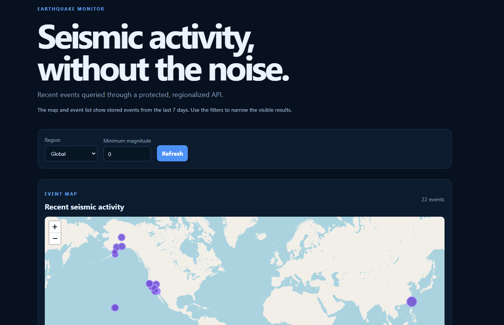

# Earthquake Monitor

---

# 🧾 GitHub About Metadata

## Demo

The demo shows the protected frontend loading stored earthquake events from the default seven-day window, displaying them on the interactive map, and applying regional and magnitude filters.

**Description**

Earthquake monitoring platform with .NET 10, Azure Functions, Oracle, React/TypeScript, Docker and Azurite, organized as a Modular Monolith with Clean Architecture.

**Topics**

azure-functions, dotnet, dotnet-10, oracle, oracle-database, oracle-wallet, react, typescript, docker, azurite, clean-architecture, modular-monolith, earthquake-monitoring, usgs, integration-tests

---

# 📖 Overview

Earthquake Monitor collects earthquake events from external seismic providers, normalizes them into an internal model, stores them in Oracle and exposes region-focused information through a protected web experience.

The project starts with a small and understandable foundation that can evolve toward USGS ingestion, regional dashboards, analytics, maps and alerts without prematurely introducing queues or microservices.

The initial local environment runs Azure Functions and Azurite in Docker, while Oracle is accessed through a Wallet mounted only into the Functions container.

## 🚧 Current status

The backend foundation currently includes:

- Oracle persistence with idempotent UPSERT using source + external_id.
- Earthquake queries by source identity, time range, magnitude and coordinates.
- Configurable geographic regions.
- Analytics summary by time range.
- USGS GeoJSON source adapter with configurable FDSN queries.
- Scheduled ingestion through an Azure Functions Timer Trigger.
- Ingestion failures are surfaced to the Functions runtime instead of being reported as successful executions.
- Unit tests for the USGS mapper and HTTP client.
- Local Docker execution with Azure Functions and Azurite.
- Oracle Wallet-based connectivity validation.
- React event list with automatic initial loading.
- Leaflet map with magnitude-scaled markers, automatic viewport fitting, and UTC origin timestamps in event popups.
- Bounded default query window covering stored events from the last seven days, with region and minimum-magnitude filters.

The repository now includes a React/TypeScript frontend, an interactive event map, and a protected query API. The frontend is designed for Vercel: browser requests go to same-origin serverless proxy functions, which keep the backend keys server-side. Production deployment infrastructure and an automated migration runner remain follow-up work.

## 🎯 Objectives

- Build a reliable earthquake ingestion foundation.
- Keep the earthquake model independent from regions.
- Support idempotent updates from USGS using `source + external_id`.
- Provide configurable regional queries.
- Establish a clean path toward analytics, maps and alerts.
- Keep local development reproducible with Docker and Azurite.

## 🏗 Architecture

~~~text
Functions / API composition root
        ↓
Module Infrastructure
        ↓
Module Application
        ↓
Module Domain
~~~

Rules:

- Domain code does not depend on Azure Functions, Oracle, USGS or HTTP.
- Application defines use-case and persistence contracts.
- Infrastructure implements Oracle, configuration and external integrations.
- Functions composes dependencies and exposes runtime endpoints.
- An earthquake is source-independent and is not assigned permanently to a region.
- Regions are geographic query concepts.

### Clean Architecture diagram

~~~mermaid
flowchart TB
    subgraph Delivery["Delivery / Composition Root"]
        Functions["Azure Functions\nHTTP triggers and local diagnostics"]
        Frontend["React + TypeScript\nevent list and map"]
    end

    subgraph Infrastructure["Infrastructure"]
        Oracle["Oracle persistence\nODP.NET + parameterized SQL"]
        USGS["USGS source adapter\nimplemented"]
        Azurite["Azurite\nlocal Azure Storage emulator"]
        Configuration["Configuration and Wallet\nlocal or CI/CD secrets"]
    end

    subgraph Application["Application"]
        UseCases["Use cases and application services"]
        Contracts["Repository and provider contracts"]
    end

    subgraph Domain["Domain"]
        Earthquake["Earthquake entity\nsource-independent"]
        Region["Region concepts\ngeographic query rules"]
        Analytics["Analytics concepts\naggregated summaries"]
    end

    Frontend --> Functions
    Functions --> UseCases
    Functions --> Configuration
    UseCases --> Contracts
    Contracts --> Oracle
    Contracts --> USGS
    Contracts --> Azurite
    UseCases --> Earthquake
    UseCases --> Region
    UseCases --> Analytics
    Oracle --> Configuration
    USGS --> Configuration

    style Delivery fill:#e8f1ff,stroke:#0062AD,stroke-width:2px
    style Infrastructure fill:#fff0e6,stroke:#F59E0B,stroke-width:2px
    style Application fill:#e9f8ef,stroke:#2E8B57,stroke-width:2px
    style Domain fill:#f3e8ff,stroke:#7C3AED,stroke-width:2px
~~~

The dependency direction points inward: Domain does not depend on Application, Infrastructure or Azure Functions.

## 🧩 Modules

### Earthquakes

Location: src/Modules/Earthquakes

- Domain entity Earthquake.
- IEarthquakeRepository contract.
- Oracle repository with parameterized SQL.
- UPSERT by SOURCE + EXTERNAL_ID.
- Search and source-identity queries.
- Oracle-to-domain mapping.

### Regions

Location: src/Modules/Regions

- Region codes and geographic bounds in the domain layer.
- IRegionCatalog application contract.
- Configurable definitions in src/EarthquakeMonitor.Functions/configuration/regions.json.

The current boundaries are approximate rectangles. Polygon/geospatial boundaries are planned for a later stage.

### Analytics

Location: src/Modules/Analytics

- IAnalyticsRepository application contract.
- Oracle summary query by time range.
- Event count, maximum magnitude and average magnitude.

## 💾 Persistence

Oracle is accessed with Oracle.ManagedDataAccess.Core and explicit parameterized SQL. Entity Framework is not currently used.

USGS metadata such as provider update time, review status, tsunami flag, alert level, significance and the original JSON payload are persisted alongside the normalized event.

The initial schema is located at:

~~~text
src/Modules/Earthquakes/Infrastructure/Persistence/Oracle/schema.sql
~~~

It contains the EARTHQUAKES table, a primary key, a unique key on SOURCE + EXTERNAL_ID, and indexes for origin time, magnitude and coordinates.

### Migrations

An automated migration runner is not implemented yet. The current schema is an initial SQL script and must be applied manually.

The current migration set includes:

~~~text
database/migrations/V002__add_usgs_metadata.sql
~~~

The migration adds USGS provenance fields and JSON validation to EARTHQUAKES. It was applied manually to the development database. The planned next step is a versioned migration runner, preferably Flyway or DbUp, executed by CI/CD or a controlled deployment step rather than by every Function startup.

## 🧰 Prerequisites

- Docker Desktop with Linux containers enabled.
- Docker Compose v2.
- .NET SDK 10.
- An Oracle database or Autonomous Database account.
- Oracle Wallet downloaded from the database provider.

## 🔐 Oracle Wallet setup

Uncompress the Wallet into:

~~~text
secrets/oracle-wallet
~~~

The directory should contain tnsnames.ora, sqlnet.ora, cwallet.sso and ewallet.p12. It is ignored by Git and mounted read-only inside Functions at /opt/oracle/wallet.

## 🐳 Docker configuration

Docker Compose runs Azurite and the Azure Functions isolated worker.

Create or edit the ignored .env file in the repository root:

~~~text
ORACLE_CONNECTION_STRING=User Id=YOUR_ORACLE_USER;Password=YOUR_ORACLE_PASSWORD;Data Source=YOUR_TNS_ALIAS;Tns_Admin=/opt/oracle/wallet
EARTHQUAKE_INGESTION_SCHEDULE=0 */5 * * * *
USGS_PAGE_SIZE=20000
USGS_INITIAL_LOOKBACK_HOURS=1
USGS_OVERLAP_MINUTES=15
~~~

Use a TNS alias defined in secrets/oracle-wallet/tnsnames.ora, for example Data Source=example_low. The template is available at [.env.example](.env.example).

Do not use a Windows path in the Docker connection string; use Tns_Admin=/opt/oracle/wallet.

Compose also reads the non-sensitive operational values for Azurite, container ports, service names, the Functions runtime and the Azure Storage emulator connection from .env. Keep the real values in .env only; .env.example is the shareable template.

### Start the environment

~~~powershell
docker compose up --build -d
docker compose ps
docker compose logs -f functions
docker compose logs -f azurite
~~~

Stop the environment:

~~~powershell
docker compose down
~~~

Delete persisted Azurite data and recreate it:

~~~powershell
docker compose down -v
docker compose up --build --force-recreate -d
~~~

## 🔌 Connection test

The Functions project exposes a local diagnostic endpoint:

~~~powershell
Invoke-RestMethod http://localhost:7071/api/health/database
~~~

Expected response:

~~~text
status database
------ --------
ok     oracle
~~~

The endpoint returns only connection status. Protect or remove it before exposing the Function App publicly.

If Oracle returns 503, inspect logs without printing the full Compose configuration:

~~~powershell
docker compose logs --tail=100 functions
~~~

Common ingestion diagnostics:

- `Value does not fall within the expected range` from `OracleParameterCollection.Add` indicates an unsupported nullable value was passed without an explicit Oracle type. The repository uses typed parameters and maps null values to `DBNull.Value`.
- `ORA-50099: This property cannot be set after a connection has been opened` indicates that `OracleConfiguration.TnsAdmin` was changed for every connection. The connection factory configures it once during initialization; it must not be reassigned per request.
- If USGS returns events but persistence fails, the Timer Trigger throws an error after logging the per-event failures. This prevents a false successful execution and allows the configured retry/deployment policy to handle the failure.

## 🧪 Testing

Run all tests:

~~~powershell
dotnet test src/EarthquakeMonitor.slnx
dotnet test tests/EarthquakeMonitor.Earthquakes.IntegrationTests
~~~

Run only the USGS unit tests:

~~~powershell
dotnet test tests/EarthquakeMonitor.Earthquakes.UnitTests/EarthquakeMonitor.Earthquakes.UnitTests.csproj
~~~

These tests cover the USGS mapper and HTTP client without calling the public USGS service, Oracle or Docker. HTTP responses are supplied by an in-memory HttpMessageHandler.

The Oracle integration test is opt-in:

~~~powershell
$env:ORACLE_INTEGRATION_TESTS="true"
$env:ConnectionStrings__Oracle="YOUR_TEST_CONNECTION_STRING"
dotnet test tests/EarthquakeMonitor.Earthquakes.IntegrationTests
~~~

Never commit the test connection string, Wallet or local settings.

## 📂 Project structure

~~~text
earth_quake_monitor/
├── src/
│   ├── EarthquakeMonitor.Functions/
│   │   ├── configuration/regions.json
│   │   └── DatabaseConnectionFunction.cs
│   ├── Modules/
│   │   ├── Earthquakes/{Domain,Application,Infrastructure}
│   │   ├── Regions/{Domain,Application,Infrastructure}
│   │   └── Analytics/{Domain,Application,Infrastructure}
│   ├── Shared/Kernel/
│   └── Shared/Infrastructure/
├── tests/EarthquakeMonitor.Earthquakes.IntegrationTests/
├── secrets/oracle-wallet/       # ignored local Wallet
├── docker-compose.yml
├── Dockerfile
├── .dockerignore
├── .env.example
└── README.md
~~~

## 🛡 Security rules

Never commit .env, local.settings.json, Oracle Wallet files, wallet.zip, passwords, connection strings, tokens, certificates, private keys or generated artifacts.

Before a commit, review:

~~~powershell
git status --short --ignored
~~~

## 🗺 Future work

- Extend the USGS adapter with pagination continuation and production resilience policies.
- Add versioned database migrations.
- Add GitHub Actions CI/CD.
- Replace rectangular region bounds with geospatial boundaries.
- Add production secret management and deployment configuration.

## Public API and abuse protection

The protected read API exposes `GET /api/v1/earthquakes`, `GET /api/v1/earthquakes/{source}/{externalId}` and `GET /api/v1/analytics/earthquakes`. Azure Functions requires `x-functions-key` and the application additionally requires `x-api-key` before executing any query.

React never receives either key. The Vercel serverless proxy in `frontend/api` reads `EARTHQUAKE_API_URL`, `EARTHQUAKE_FUNCTION_KEY` and `EARTHQUAKE_API_KEY` from server-side environment variables and forwards only responses. Configure the Vercel project root as `frontend` and do not use `VITE_*` variables for secrets.

Queries are limited to 100 rows and a maximum period of 366 days. Date, magnitude, coordinate and region parameters are validated. The API applies an instance-local fixed-window rate limit controlled by `PublicApi__RequestsPerMinute` and returns `429` with `Retry-After` when exceeded. The Vercel proxy caches identical reads briefly. Production should add Azure Front Door or API Management with WAF and rate limiting before the Function App.

When the event query does not receive an explicit `from` and `to` range, it uses the last seven days and orders results by origin time descending. This bounded default is used by the frontend map and event list, which display up to 100 stored events. Explicit time ranges remain available for bounded historical queries within the API limit.

Ingestion is not part of the browser API. The scheduled Timer Trigger is the normal path. Operators can manually invoke `POST /api/management/ingestion`, but it uses `AuthorizationLevel.Admin` and requires the Functions host master key. Store that key only in an operator-controlled secret store; never configure it in the frontend.

Vercel server-side variables:

~~~text
EARTHQUAKE_API_URL=https://<functions-app>
EARTHQUAKE_API_KEY=<same-value-as-PublicApi__Key>
~~~

### Test the Frontend with Docker

The frontend can run in Docker together with Functions and Azurite. Vite acts as the development proxy: keys are injected only into the container process and never reach the browser.

First generate `frontend/pnpm-lock.yaml` in an environment with valid TLS certificates. Docker mounts the local Functions host key at `/run/secrets/functions-keys/host.function.default`; the key stays inside the containers and is never sent to the browser.

~~~powershell
docker compose up -d
docker compose logs -f frontend
~~~

Open `http://localhost:5173`. The internal proxy translates `/api/earthquakes` to `/api/v1/earthquakes` and connects to the `functions` service; `EARTHQUAKE_API_KEY` must not be configured as a `VITE_*` variable.

To stop the services:

~~~powershell
docker compose down
~~~

### Frontend dependency installation

The frontend uses pnpm exclusively. Do not use `npm install`, `npm ci`, `npx`, or `pnpm dlx` for this project. `frontend/package.json` pins the package manager and all direct dependency versions; the committed `pnpm-lock.yaml` must be generated in a trusted environment and CI must use a frozen lockfile.

The committed `frontend/.npmrc` enforces the npm registry over TLS, lockfile use, exact saves, peer-dependency validation, store-integrity verification, a 24-hour package release age, and disabled lifecycle scripts. A dependency that requires an install or build script is intentionally rejected until it is reviewed and explicitly approved. Install with:

~~~powershell
cd frontend
corepack pnpm install --frozen-lockfile --ignore-scripts
corepack pnpm run build
corepack pnpm run audit:production
~~~

Never disable TLS verification, never set `strict-ssl=false`, never use untrusted registries, and never place credentials in `.npmrc`.
